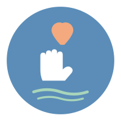

<p align="center">
  
</p>

<h1 align="center">Solace</h1>

<p align="center">
  <strong>A compassionate AI companion for mental wellness — powered by Gemma 4, running entirely on-device.</strong>
</p>

<p align="center">
  <a href="https://github.com/HenshinLabs/solace-gemma4good/releases"></a>
  <a href="https://github.com/HenshinLabs/solace-gemma4good/blob/main/LICENSE"></a>
  <a href="https://developer.android.com"></a>
  <a href="https://kotlinlang.org"></a>
  <a href="https://github.com/ggerganov/llama.cpp"></a>
  <a href="https://www.kaggle.com/competitions/gemma-4-good-hackathon"></a>
</p>

<p align="center">
  <a href="#features">Features</a> •
  <a href="#how-it-works">How It Works</a> •
  <a href="#architecture">Architecture</a> •
  <a href="#getting-started">Getting Started</a> •
  <a href="#documentation">Documentation</a> •
  <a href="#license">License</a>
</p>

---

## Overview

**Solace** is an Android application designed to provide accessible, private, and immediate mental health support through on-device artificial intelligence. Built for the [Gemma 4 Good Hackathon](https://www.kaggle.com/competitions/gemma-4-good-hackathon), it runs Google's Gemma 4 E2B model locally on the user's device — no internet connection required for conversations, no data ever leaves the phone.

Solace was created for people experiencing anxiety, panic attacks, trauma, or suicidal thoughts. It offers guided therapeutic sessions, real-time voice interaction, vision understanding, and crisis resources — all powered by a 3 billion parameter language model that fits in the palm of your hand.

### Why On-Device?

- **Privacy**: Sensitive mental health conversations never touch a server
- **Accessibility**: Works offline — in rural areas, during network outages, or in crisis moments
- **Speed**: No API latency, no rate limits, no subscription fees
- **Trust**: Users know their data stays on their device

### Built On

Solace extends [MasterLLM](https://github.com/Shuvam-Banerji-Seal/Master_LLM_app), a production-grade Android LLM inference framework by [Shuvam Banerji Seal](https://github.com/Shuvam-Banerji-Seal), with a complete mental health companion UI, therapeutic session system, multimodal vision, voice interaction, and web search agent capabilities.

---

## Features

### AI Companion Chat
- **Conversational AI**: Natural, empathetic conversations powered by Gemma 4 E2B (3B parameters, Q4_K_M quantized)
- **Multi-session Management**: Create, continue, and organize separate conversations
- **Thinking Token Display**: View the model's internal reasoning process (collapsible)
- **Web Search**: AI can search the web for current health information via DuckDuckGo

### Guided Therapeutic Sessions
Pre-built, evidence-based therapeutic exercises with specialized system prompts:

| Session | Focus | Techniques |
|---------|-------|------------|
| **Anxiety Relief** | Calming anxious thoughts | Box breathing, 5-4-3-2-1 grounding, progressive muscle relaxation |
| **Panic Attack Support** | Immediate stabilization | Slow breathing, sensory grounding, cold stimulation |
| **Sleep & Rest** | Bedtime relaxation | Body scan, guided visualization, worry acknowledgment |
| **Daily Check-in** | Mood tracking | Emotional reflection, positive identification, self-care |
| **Crisis Support** | Safety planning | De-escalation, resource sharing, safety plan creation |

### Voice Interaction
- **Speech-to-Text**: Offline voice input using Vosk (no Google dependency)
- **Text-to-Speech**: KittenTTS nano for AI response audio playback
- **Thinking Block Filtering**: Thinking tokens automatically stripped before TTS

### Vision Understanding
- **Multimodal Input**: Attach images for the AI to analyze and discuss
- **Gemma 4 Vision**: Native image understanding via mmproj projector
- **Automatic Pipeline**: Image → RGB encoding → vision encoder → language model

### Crisis Resources
Always-accessible emergency contacts with tap-to-call:
- **988 Suicide & Crisis Lifeline** (US)
- **iCall India**
- **Vandrevala Foundation**
- **Crisis Text Line** (text HOME to 741741)

### On-Device Inference Engine
- **llama.cpp**: Native C++ inference with JNI bridge
- **ARM64 Optimized**: 7 library variants for different CPU capabilities (FP16, Dot Product, SVE, I8MM)
- **Vulkan GPU**: Automatic GPU acceleration when available
- **Gemma 4 Chat Template**: Native `<|turn>`/`<turn|>` delimiter support

---

## How It Works

```
┌─────────────────────────────────────────────────────────────────┐
│                        Solace App                               │
├─────────────────────────────────────────────────────────────────┤
│  Presentation Layer (Jetpack Compose)                           │
│  ┌──────────┐ ┌──────────┐ ┌──────────────┐ ┌──────────────┐   │
│  │   Home   │ │   Chat   │ │   Guided     │ │   Settings   │   │
│  │  Screen  │ │  Screen  │ │   Sessions   │ │    Screen    │   │
│  └────┬─────┘ └────┬─────┘ └──────┬───────┘ └──────────────┘   │
├───────┼─────────────┼─────────────┼─────────────────────────────┤
│  ViewModel Layer                                               │
│  ┌──────────────────────────────────────────────────────────┐   │
│  │                    ChatViewModel                         │   │
│  │  Conversation │ Inference │ ASR │ TTS │ Web Search │ ... │   │
│  └────────────────────────────┬─────────────────────────────┘   │
├───────────────────────────────┼─────────────────────────────────┤
│  Runtime Layer (Native C++)                                    │
│  ┌──────────────┐ ┌──────────┴──┐ ┌──────────────────────────┐ │
│  │  GgufEngine  │ │ LLMInference│ │  mtmd (multimodal)       │ │
│  │  (Kotlin)    │ │  (C++)      │ │  clip.cpp + mtmd.cpp     │ │
│  └──────┬───────┘ └──────┬──────┘ └──────────────────────────┘ │
├─────────┼────────────────┼──────────────────────────────────────┤
│  llama.cpp (submodule)                                          │
│  ┌──────┴────────────────┴──────────────────────────────────┐   │
│  │  ggml (tensor ops) │ ggml-cpu │ ggml-vulkan (GPU)       │   │
│  └──────────────────────────────────────────────────────────┘   │
└─────────────────────────────────────────────────────────────────┘
```

### Data Flow: Chat Message

```
User Input → ChatViewModel.sendMessage()
  → ensureEngineReady() → GgufEngine.load() (if needed)
  → GgufEngine.getResponseAsFlow(query)
    → LLMInference.startCompletion(query) — tokenize, apply chat template
    → LLMInference.completionLoop() — llama_decode() → sample → token
    → emit(piece) — streaming to UI
  → ConversationRepository.addMessage() — persist to Room DB
  → KittenTtsEngine.speak(filteredText) — TTS playback
```

### Data Flow: Image Analysis

```
Image Attachment → Bitmap → bitmapToRgbBytes() (RGB byte array)
  → GgufEngine.startCompletionWithImage(prompt, rgbBytes, width, height)
    → mtmd_bitmap_init(width, height, rgbBytes)
    → mtmd_tokenize() — encode image + text
    → mtmd_helper_eval_chunks() — vision encoder + language model
    → completionLoop() — token generation
  → Display response with image context
```

---

## Architecture

Solace follows **Clean Architecture** with a multi-module Gradle structure:

| Layer | Modules | Purpose |
|-------|---------|---------|
| **Presentation** | `feature-chat`, `feature-roleplay`, `feature-settings`, `core-ui` | Compose UI, ViewModels |
| **Domain** | `core-domain` | Business models, repository interfaces |
| **Data** | `core-data`, `core-network`, `core-ollama` | Repositories, database, ASR, TTS |
| **Runtime** | `runtime-gguf`, `runtime-safetensors`, `runtime-imagegen` | Native inference engines |
| **Application** | `app` | DI, navigation, download flow, utilities |

### Key Components

- **GgufEngine** — Kotlin JNI wrapper for llama.cpp (672 lines)
- **LLMInference** — C++ model loading, inference, multimodal (498 lines)
- **ChatViewModel** — Conversation management, inference, ASR, TTS, web search (1,696 lines)
- **RoleplayViewModel** — Therapeutic session management (1,099 lines)
- **VoskSpeechManager** — Offline speech recognition
- **KittenTtsEngine** — ONNX-based text-to-speech
- **ToolRegistry** — Web search, URL fetch, time tools for the AI agent

---

## Getting Started

### Prerequisites

- **JDK 17**
- **Android SDK** with Platform 36 and Build-Tools 36
- **NDK** (for native C++ compilation)
- **CMake 3.22.1+**
- **Git** (for submodules)

### Build

```bash
# Clone with submodules
git clone --recurse-submodules https://github.com/HenshinLabs/solace-gemma4good.git
cd solace-gemma4good

# Set up SDK path
echo "sdk.dir=/path/to/Android/Sdk" > local.properties

# Build debug APK
./gradlew assembleDebug

# Output: app/build/outputs/apk/debug/Solace-v2.0.5c-debug.apk
```

### Install

```bash
adb install app/build/outputs/apk/debug/Solace-v2.0.5c-debug.apk
```

### First Launch

1. Open Solace
2. Review the model download consent dialog (~4 GB total: 3.1 GB model + 941 MB vision projector)
3. Tap "Download Model" — both files download from HuggingFace with SHA-256 verification
4. After download: Home screen appears with mood options and crisis resources

---

## Tech Stack

| Category | Technology |
|----------|------------|
| Language | Kotlin 2.1.0, C++20 |
| UI | Jetpack Compose (BOM 2024.12.01) |
| Architecture | Clean Architecture + MVVM |
| DI | Hilt 2.53.1 |
| Database | Room 2.6.1 |
| Native | llama.cpp, mtmd (multimodal) |
| ASR | Vosk 0.3.47 (offline) |
| TTS | KittenTTS ONNX + ONNX Runtime 1.18.0 |
| Search | DuckDuckGo HTML scraping |
| Build | Gradle 8.x, AGP, CMake 3.22.1 |

### Model Details

| Model | Size | Quantization | Context | Source |
|-------|------|-------------|---------|--------|
| Gemma 4 E2B IT | ~3.1 GB | Q4_K_M | 128K tokens | [unsloth/gemma-4-E2B-it-GGUF](https://huggingface.co/unsloth/gemma-4-E2B-it-GGUF) |
| Gemma 4 Vision (mmproj) | ~941 MB | BF16 | — | [bjivanovich/Gemma4-E2B-Vision-GGUF](https://huggingface.co/bjivanovich/Gemma4-E2B-Vision-GGUF) |
| Vosk (speech) | ~40 MB | — | — | [alphacephei.com/vosk/models](https://alphacephei.com/vosk/models/vosk-model-small-en-us-0.15.zip) |
| KittenTTS (bundled) | ~23 MB | ONNX | — | Bundled in `assets/kittentts/` |

---

## Documentation

| Document | Description |
|----------|-------------|
| [Architecture](docs/architecture.md) | System architecture, data flow, state management |
| [Module Reference](docs/modules.md) | All 17 Gradle modules with file listings |
| [API Reference](docs/api-reference.md) | Key classes, methods, parameters, return types |
| [Native Layer](docs/native-layer.md) | C++/JNI/llama.cpp integration, CMake config, multimodal pipeline |
| [Build Guide](docs/build-guide.md) | Prerequisites, setup, build commands, signing |
| [User Flows](docs/user-flows.md) | 9 user journeys with flow diagrams |
| [Solace Features](docs/solace-features.md) | Therapeutic sessions, crisis resources, theming |
| [Troubleshooting](docs/troubleshooting.md) | Known issues, root causes, fixes |

---

## Hackathon Submission

**Solace** is a submission for the [Gemma 4 Good Hackathon](https://www.kaggle.com/competitions/gemma-4-good-hackathon) on Kaggle.

### Problem Statement

Mental health support is inaccessible to billions of people worldwide. Long wait times, high costs, social stigma, and geographic barriers prevent people from getting help when they need it most — especially during panic attacks, anxiety episodes, or suicidal crises.

### Solution

Solace puts a compassionate AI companion directly on the user's phone. Using Google's Gemma 4 E2B model running entirely on-device through llama.cpp, it provides:

- **Immediate access** — no appointments, no waitlists, no internet required
- **Complete privacy** — sensitive conversations never leave the phone
- **Evidence-based techniques** — guided breathing, grounding, cognitive reframing, safety planning
- **Crisis resources** — always-visible helpline numbers with tap-to-call
- **Voice interaction** — for users who can't type during distress
- **Vision support** — analyze images for art therapy, journaling, or visual grounding

### Technical Innovation

- **Full Gemma 4 E2B on Android**: 3B parameter model with 128K context, Q4_K_M quantized, running via native C++ with ARM64 SIMD optimizations
- **Multimodal Vision**: Gemma 4's native vision support via mtmd (multimodal) library — first Android implementation
- **Offline Voice Pipeline**: Vosk ASR + KittenTTS — complete voice interaction without cloud services
- **Agent Tools**: Web search capability for current health information
- **7 ARM64 Variants**: Runtime CPU feature detection selects the optimal native library

## Built With Gemma

Solace was developed with the help of **Gemma 4 31B IT** ([google/gemma-4-31B-it](https://huggingface.co/google/gemma-4-31B-it)) running on an **NVIDIA A100 80GB GPU** as a coding assistant. The 31-billion parameter model served as the primary development companion — assisting with architecture design, native C++/JNI integration, llama.cpp multimodal pipeline implementation, Kotlin coroutine flows, Jetpack Compose UI, CMake configuration, and debugging across the entire 17-module Android codebase.

Gemma 4 31B was instrumental in:
- Designing the native multimodal (mtmd) pipeline for image understanding on Android
- Implementing the 7 ARM64-optimized library variants with runtime CPU feature detection
- Building the Vosk ASR and KittenTTS integration for offline voice interaction
- Crafting therapeutic system prompts for mental health guided sessions
- Resolving complex cross-module dependency and Hilt injection issues

The same Gemma 4 family — specifically the E2B (3B parameter) variant — powers the on-device inference in the final application.

---

## License

Solace is licensed under the **GNU General Public License v3.0** — see the [LICENSE](LICENSE) file for details.

This project builds upon [MasterLLM](https://github.com/Shuvam-Banerji-Seal/Master_LLM_app) by Shuvam Banerji Seal.

See [THIRD_PARTY_NOTICES.md](THIRD_PARTY_NOTICES.md) for third-party licenses including llama.cpp (MIT), Vosk (Apache 2.0), and ONNX Runtime (MIT).

---

<p align="center">
  <strong>Solace</strong> — Built with care for those who need it most.<br/>
  <sub>A submission for the <a href="https://www.kaggle.com/competitions/gemma-4-good-hackathon">Gemma 4 Good Hackathon</a> by <a href="https://github.com/HenshinLabs">HenshinLabs</a></sub>
</p>
